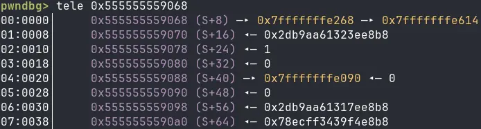
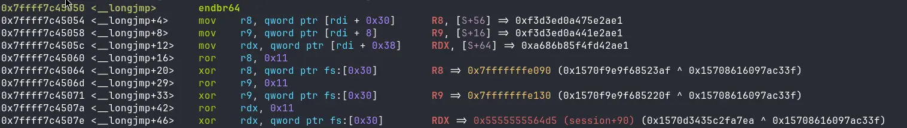

I participated in the TeamItaly.IT quals this weekend, the Italian pre-qualification CTF for the national team. One of the challenges centered around the `setjmp()` and `longjmp()` libc functions. I couldn't find many resources explaining their internals in a ctf context, so here is a short post on this fun technique.
## setjmp and longjmp
While a standard `goto` can only jump within the same function, the `setjmp` and `longjmp` combo acts as a non-local `goto`.

`setjmp` stores the state of the callee saved registers (`RBX`, `RBP` `R12`-`R15`), stack pointer, and instruction pointer into a buffer, and then returns zero. When `longjmp` is subsequently called, the registers get restored from the buffer. `setjmp` writes its return address as the saved instruction pointer. This means that `longjmp` will jump directly after the `setjmp` call, additionally it will set the return value (stored in `rax`) to the `val` argument passed to longjmp.

```c
 #include <setjmp.h>
 int setjmp(jmp_buf env); //returns 0 when called directly
 void longjmp(jmp_buf env, int val); 
```
## jmp_buf
So, how does `setjmp` exactly save our registers? Well, looking into the libc implementation, we find this interesting `typedef`:

```c
//glibc https://elixir.bootlin.com/glibc/glibc-2.43.9000/source/setjmp/setjmp.h#L36
typedef struct __jmp_buf_tag jmp_buf[1];
```

`jmp_buf` is defined as an array of only one element of type `__jmp_buf_tag`. This is cool because when an array is passed in a function call, it "decays" into a pointer. Without this trick, we would need to prepend an `&` in front of the argument. Let's look at `__jmp_buf_tag` now:

```c
//glibc https://elixir.bootlin.com/glibc/glibc-2.43.9000/source/setjmp/bits/types/struct___jmp_buf_tag.h#L26
/* Calling environment, plus possibly a saved signal mask.  */
struct __jmp_buf_tag
{
	__jmp_buf __jmpbuf;		/* Calling environment.  */
	int __mask_was_saved;	/* Saved the signal mask?  */
	__sigset_t __saved_mask;	/* Saved signal mask.  */
};
```

This struct doesn't really tell us much. Why are we now reading the word signal? Well, there is a variation of `setjmp` called `sigsetjmp` (along with `siglongjmp`) that also saves the signal mask into the buffer.

So for our case, only the first element of `__jmp_buf_tag` is interesting. Let's look at it:

```c
//glibc https://elixir.bootlin.com/glibc/glibc-2.43.9000/source/sysdeps/x86/bits/setjmp.h#L31
typedef long int __jmp_buf[8];
```

It's literally an 8-element, 64-bit integer array, nothing special. If we want to understand how the values are saved inside this array, it is easier to look directly through the lens of a debugger than to search through a huge amount of different implementations of `setjmp` for all architectures. For x86-64, this is the `__jmp_buf[8]` struct:

| `__jmp_buf[8]` | is mangled |
| -------------- | ---------- |
| `RBX`          | no         |
| `RBP`          | yes        |
| `R12`          | no         |
| `R13`          | no         |
| `R14`          | no         |
| `R15`          | no         |
| `RSP`          | yes        |
| `RIP`          | yes        |

Wait, what does _mangled_ mean? Well, let's look at this example of a `__jmp_buf[8]` struct:



As you can notice, RBP, RSP, and RIP should all be addresses, but they got mangled in some way. This means that we cannot simply overwrite them with a new address to modify these registers.
### breaking the mangling

By setting a breakpoint in the `__longjmp` function in GDB, it is possible to understand exactly how the function demangles the pointers.




It first executes a `ror` of 17 bits (`0x11`), and then it XORs the resulting value with a predetermined key taken from the Thread Control Block at offset `0x30` (`fs:0x30`).

:::note
When the OS loads a binary, it stores two qwords of random data in the Thread Control Block (TCB). The first qword is used as a stack canary (`fs:0x28`), and the second qword is used for pointer mangling. The `exit_funcs` use the same mangling key as `setjmp` ([link](https://blog.davidherm.es/posts/babyheap_2/#exploiting-with-exit_func-overwrite) to an old writeup).
:::

This means that as long as we have a leak of the return address, it is possible, for example, to recover the key this way:

```python
def recover_key(mangled_addr:int, real_addr:int):
	return ror(mangled_addr, 0x11, 64) ^ real_addr
```

After that, we can mangle an arbitrary pointer by doing the reverse of the demangling operation:

```python
def mangle_addr(real_addr:int, key:int):
	return rol(real_addr ^ key, 0x11, 64)
```

## CTF challenges
If you want to try this technique, I will add a list of challenges below:

- txvm (Teamitaly 2026 Quals): waiting for release
